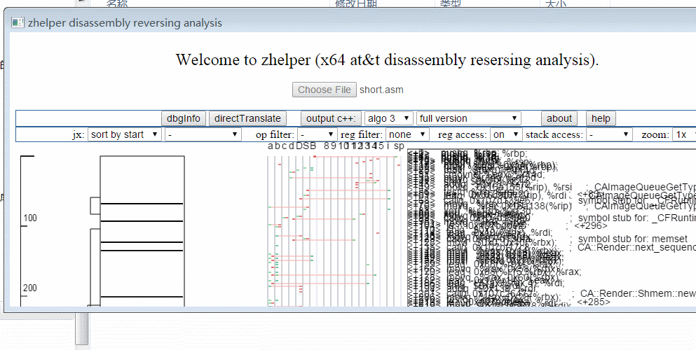

# zhelper-disassembly-reversing-tool
a tool for analysing and reversing x64 at&amp;t disassembly

引擎使用JS，应用程序CEF封装。

[PicInCN](https://img2020.cnblogs.com/blog/665551/202005/665551-20200508181836160-1421244411.gif)

[开发日志 develop journal](https://www.cnblogs.com/bbqzsl/p/12852352.html)
